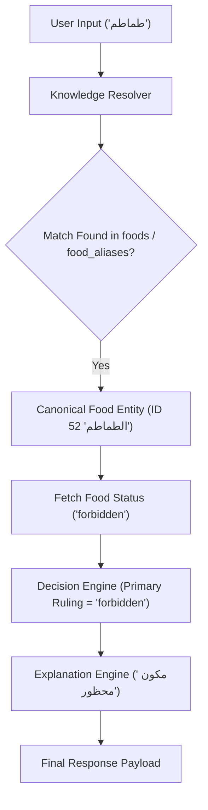
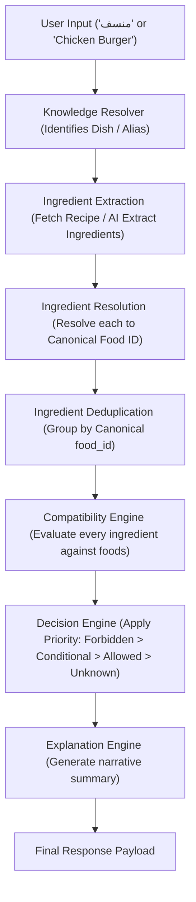
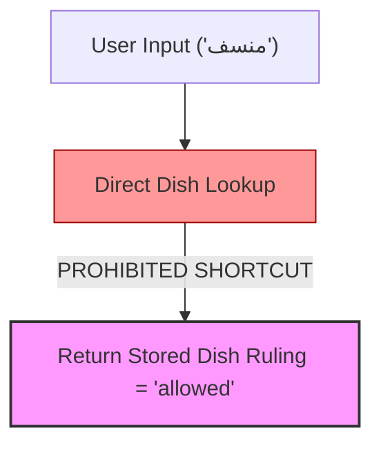

# Analysis Pipeline Architecture & Governance Specification

This specification defines the single, mandatory analysis architecture for all current and future input modalities in the Tayyibati platform.

---

## 🏛️ Comprehensive Analysis Pipeline

Every analysis request—regardless of whether it originates from text search, camera capture, OCR label scanning, barcode scanning, voice search, or AI meal chat—MUST execute through the exact 10-stage pipeline shown below.

```
─────────────────────────────────────────────────────────────────────────────
                            INPUT MODALITIES
            ┌─────────┬──────────┬───────┬─────────┬───────┐
            │  Text   │  Camera  │  OCR  │ Barcode │ Voice │
            └────┬────┴────┬─────┴───┬───┴────┬────┴───┬───┘
                 │         │         │        │        │
                 └─────────┴────┬────┴────────┴────────┘
                                │
                                ▼
                       Intent Detection
                                │
                                ▼
                     Entity Classification
                                │
                                ▼
                      Ingredient Extraction
                                │
                                ▼
                      Ingredient Resolution
                                │
                                ▼
                        Knowledge Engine
                                │
                                ▼
                      Compatibility Engine
                                │
                                ▼
                        Decision Engine
                                │
                                ▼
                       Explanation Engine
                                │
                                ▼
                         Final Response
─────────────────────────────────────────────────────────────────────────────
```

---

## 🔍 Stage-by-Stage Architecture Breakdown

| Stage | Purpose & Responsibilities | Inputs | Outputs | Allowed Dependencies | Forbidden Shortcuts |
| :--- | :--- | :--- | :--- | :--- | :--- |
| **1. Input Gateway** | Receives raw input payload from client. | Raw text, image buffer, OCR text, barcode string. | Standardized `RawInputPayload` object. | Protocol parsers. | Bypassing gateway directly to AI. |
| **2. Intent Detection** | Identifies query intent (`SPECIFIC_INGREDIENT`, `SPECIFIC_DISH`, `FREE_FORM_MEAL`, `PRODUCT_BRAND`). | `RawInputPayload` | `UserIntent` enum. | `knowledgeCache.ts` | Hardcoded intent mapping. |
| **3. Entity Classification** | Determines if target is a `SINGLE_FOOD` or a `COMPOSITE` food/dish. | `UserIntent` & Query text | `EntityType` (`SINGLE_FOOD` vs `COMPOSITE`) | Knowledge Engine cache | Direct dish ruling lookup without decomposition. |
| **4. Ingredient Extraction** | Decomposes composite entities into raw component ingredient names. | `COMPOSITE` entity or raw recipe | `rawIngredientNames: string[]` | `dish_ingredients` table / AI extractor fallback | Classifying composite meal as whole entity. |
| **5. Ingredient Resolution** | Resolves each raw ingredient name to a canonical food entity using priority hierarchy. | Raw ingredient strings | `IngredientAnalysisItem[]` | `resolveSingleIngredient()`, `food_aliases`, `foods` | Calling AI when ingredient resolves locally. |
| **6. Knowledge Engine** | Supplies single source of truth for food rulings (`foods` table). | Canonical `foodId` list | `FoodStatus` rulings & reasons | `foods` table, `knowledgeCache.ts` | Reading stored compatibility from `dishes`. |
| **7. Compatibility Engine** | Evaluates individual ingredient health rulings. | `IngredientAnalysisItem[]` & `FoodStatus` | Categorized arrays (`allowed`, `forbidden`, `conditional`, `unknown`) | `dishCompatibilityEngine.ts` | Mutating ingredient rulings dynamically outside `foods`. |
| **8. Decision Engine** | Computes overall dish/meal compatibility ruling. | Categorized ingredient arrays | `finalCompatibility` (`allowed` \| `forbidden` \| `conditional` \| `unknown`) | Decision priority matrix (`Forbidden` $\rightarrow$ `Conditional` $\rightarrow$ `Allowed` $\rightarrow$ `Unknown`) | Making unknown ingredients automatically forbidden. |
| **9. Explanation Engine** | Generates human-readable Arabic & English summary explanations. | Final ruling & categorized ingredients | `ExplanationPayload` | Narrative generators | Returning bare ruling without explanation. |
| **10. Final Response** | Constructs backward-compatible `AnalysisReport` payload for client. | All engine outputs | `AnalysisReport` JSON payload | Response serializer | Omission of mandatory 7 ingredient fields. |

---

## 🚫 NON-NEGOTIABLE ARCHITECTURE RULES

### RULE 1: Foods are the Only Source of Truth
Dietary compatibility rulings (`allowed`, `forbidden`, `conditional`, `unknown`) exist **ONLY** in the `foods` table. No other entity, schema, table, or module may store or define compatibility.

### RULE 2: Composite Entities MUST NEVER Be Classified Directly
Composite entities (dishes, sandwiches, burgers, pizzas, mansaf, koshari, soups, salads, desserts, restaurant meals, recipes, packaged meals) **MUST ALWAYS** be decomposed into component ingredients prior to compatibility evaluation.

### RULE 3: Compatibility is ALWAYS Calculated, NEVER Stored
Dishes and composite meals contain **ZERO** stored compatibility fields. Compatibility is computed dynamically from ingredient rulings at query time.

```
CORRECT:  Dish ➔ Extract Ingredients ➔ Resolve Ingredients ➔ Evaluate Compatibility ➔ Decision
WRONG:    Dish ➔ Stored Compatibility Lookup ➔ Decision
```

### RULE 4: Unknown Ingredients MUST Remain Unknown
Unmapped or unrecognized ingredients must be preserved as `unknown` with low confidence. Invoking arbitrary guesswork or hallucinating canonical food mappings is strictly prohibited.

### RULE 5: AI is ALWAYS the Last Option
Strict resolution priority:
```
Knowledge Cache ➔ Food Alias ➔ Canonical Food ➔ Dish Alias ➔ OCR Alias ➔ AI (LAST ONLY)
```
AI MUST NEVER be invoked if an ingredient or entity resolves locally in the Knowledge Engine.

### RULE 6: Mandatory Ingredient Metadata Fields
Every resolved ingredient MUST include all 7 fields:
`status`, `reason`, `notes`, `confidence`, `confidenceScore`, `resolvedBy`, `provenance`.

### RULE 7: Every Final Decision MUST Be Explainable
Every response MUST provide a human-readable explanation generated from component ingredients explaining **WHY** the decision was reached.

---

## ⚙️ Engine Separation of Responsibilities

- **Knowledge Engine:** Responsible ONLY for canonical foods, food aliases, dishes, dish aliases, recipes, countries, in-memory caching.
- **Resolver:** Responsible ONLY for normalization, matching, deduplication, and resolving names to canonical food IDs.
- **Compatibility Engine:** Responsible ONLY for ingredient compatibility evaluation against `foods`.
- **Decision Engine:** Responsible ONLY for overall composite compatibility calculation, overall score, and category summaries.
- **Explanation Engine:** Responsible ONLY for human-readable Arabic/English explanation narratives, tips, and recommendations.

*No engine may perform another engine's responsibility.*

---

## 📐 Architecture Decision Flow Diagrams

### Flow 1: Single Food Query Flow


### Flow 2: Composite Food Query Flow (Correct Architectural Flow)


### Flow 3: FORBIDDEN Direct Classification Anti-Pattern (PROHIBITED)

